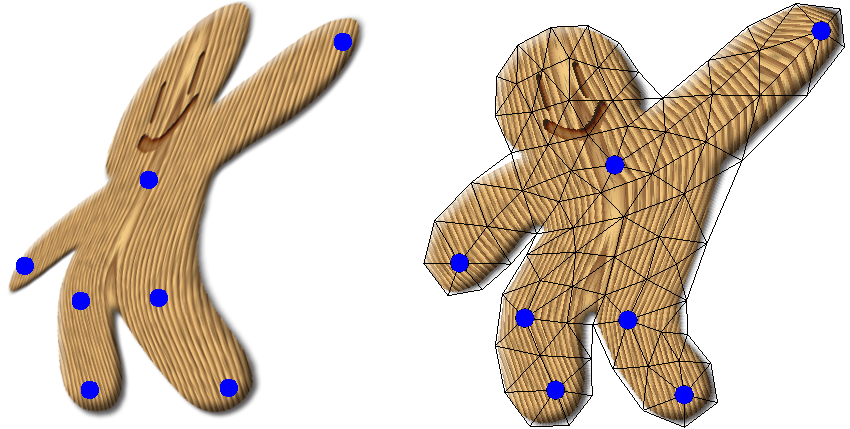
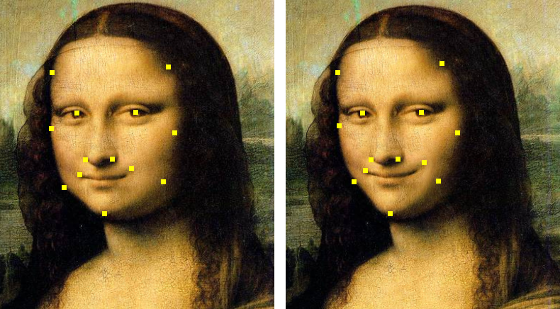
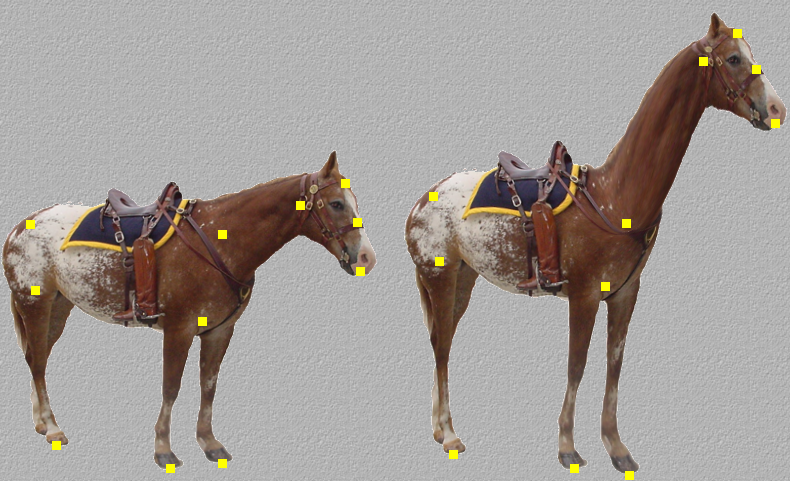
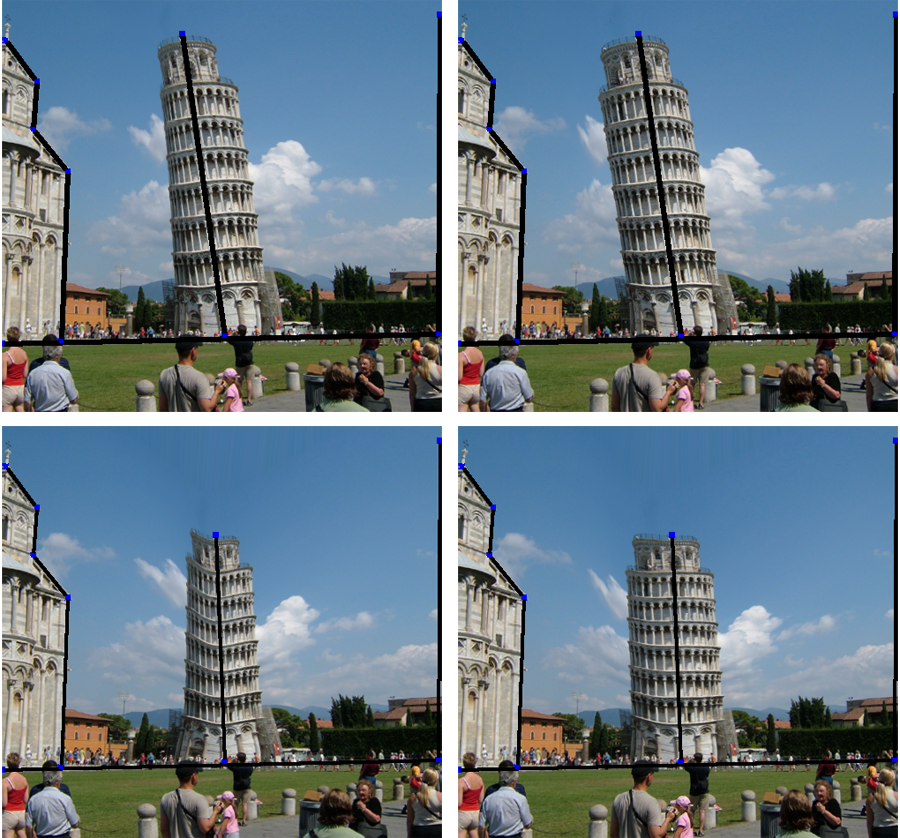
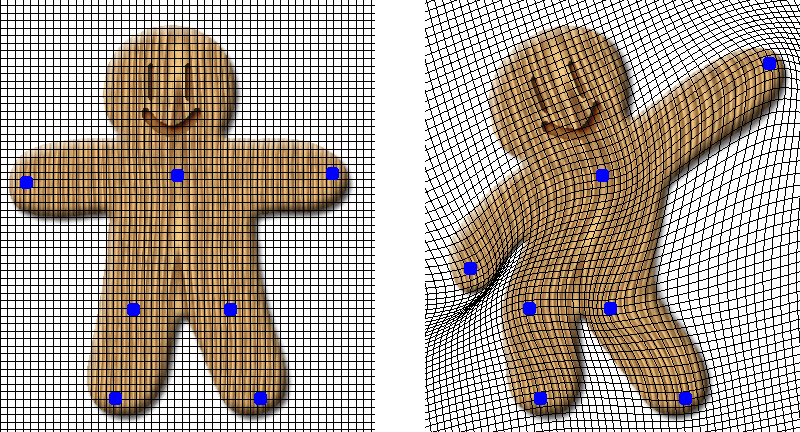
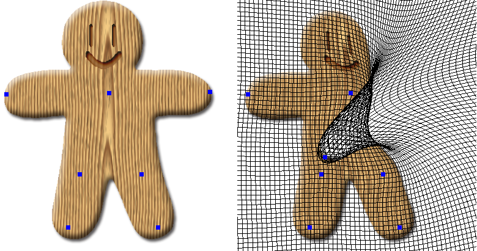

[TOC]

# Image Deformation Using Moving Least Squares

图1：(a) 以蓝色表示控制点的原图；(b) 使用仿射变换的移动最小二乘变形图；(c) 使用相似变换的移动最小二乘变形图；(d) 使用刚体变换的移动最小二乘变形图

## Abstract

提出了基于使用各种线性函数 (仿射变换、相似变换、刚体变换) 的移动最小二乘法的图像变形。允许通过一组点或线段来指定变形，后者用来控制图像中的曲线和轮廓。对于每种技术，都提出了封闭式解决方案，产生快速变形，可实时执行。

## 1 Introduction

从动画到变形和医学成像，图像变形用途很多。要执行这些变形，用户可以选择一些 handles 来控制变形，可以是点集、线段甚至是多边形网格。当用户修改 handles 的位置和方向时，图像应该以直观地方式变形。

把这个变形当作一个函数 $f$ ，将未变形图像上的点映射到变形图像上。对未变形图像上每个点 $v$ 应用函数 $f$ 生成变形图像。现考虑一张带有一组 handles $p$ 的图像，用户将 $p$ 移动到新位置 $q$ 。为使 $f$ 有用，它必须满足下述特性：

- 插值：handles $p$ 应该直接映射到变形 $q$ (例如：$f(p_i) = q_i$) 
- 平滑：$f$ 应该产生平滑的变形
- 同一性：如果变形的 handles $q$ 和 $p$ 一样，$f$ 应该是恒等函数 ($q_i = p_i \Rightarrow f(v) = v $) 

这些特性和离散数据插值中使用的特性非常相似。前两个特性表明函数 $f$ 对离散数据插值并且是平滑的。最后一个特性有时在近似领域中被称为线性精度。它表明如果数据是从一个线性函数采样的，那么插值将从重现该线性函数。由于这些相似之处，许多变形方法借用离散数据插值的技术也不足为奇了。

### Previous Work

图2：图1测试形状使用薄板样条的变形图 (左)；Igarashi 等人的方法的变形图 (右)

- Grid-based

  - 使用二元三次曲线来生成 $C^2$ 变形
  - 对齐网格线

- Shepard's interpolant

- thin-plate splines

  - 最小化变形中的弯曲量
  - 单点来作为变形 handle
  - 局部不均匀的缩放和剪切

- point-based

  - 尽可能刚体
  - 局部缩放和剪切最小化

### Contributions

- 提出基于线性移动最小二乘法的变形方法
- 为减少局部缩放和剪切，限制了MLS中相似和刚体变换使用到的变换类
- 避免三角化输入图像和产生全局平滑
- 推导出相似和刚体MLS的闭合形式的公式，公式简单易于实现，且能够实时变形。推导依赖于相似变换和刚体变换中令人惊讶且鲜为人知的关系，最小化常见的最小二乘问题。公式不需要使用通用线性求解器。
- 由点集扩展到线段，并为产生变形方法提供封闭形式的表达式

## 2 Moving Least Squares Deformation

考虑基于用户控制变形的点集来构建图像变形。设 $p$ 是控制点集合，而 $q$ 是控制点 $p$ 的变形位置。使用移动最小二乘法构建满足概述中三个特性的函数 $f$ 。给定图像中的点 $v$，求解最优的仿射变换 $l_V(x)$ ，最小化
$$
\sum_i w_i |l_v (p_i) - q_i|^2 \tag{1}
$$
其中 $p_i$ 和 $q_i$ 是行向量，并且权重 $w_i$ 具有形式
$$
w_i = \frac{1}{|p_i - v|^{2\alpha}}
$$
因为权重 $w_i$ 在这个最小二乘问题中取决于求值的点 $v$，因此称这是一个移动最小二乘法最小化。因此，对于每个 $v$ 都获取一个不同的变换 $l_v(x)$ 。

定义变形函数为 $f(v) = l_v(v)$ 。当 $v$ 趋于 $p_i$ 时，$w_i$ 趋于无穷，函数 $f$ 插值 ($f(p_i) = q_i$) 。而且，如果 $q_i = p_i$ ，那么对于所有的 $x$ ，有 $l_v(x) = x$ ，此时函数 $f$ 是恒等变换 $f(v) = v$ 。最终，变形函数 $f$ 具有处处光滑的特性 (除了 $\alpha \leq 1$ 的控制点 $p_i$) 。

因为 $l_v(x)$ 是一仿射变换，所以 $l_v(x)$ 由两部分组成：一线性变换矩阵 $M$ 和平移矩阵 $T$ 。
$$
l_v(x) = x M + T \tag{2}
$$
可移从这个最小化问题中除平移 $T$ 进一步简化公式。公式1是 $T$ 的二次方程。因为最小值是 $l_v(x)$ 对每个自由变量的导数为零，可以用矩阵 $M$ 直接求解出 $T$ 。对 $T$ 中的自由变量求偏导数得到一个线性方程组。解 $T$ 得
$$
T = q_* - p_* M
$$
其中 $p_*$ 和 $q_*$ 是加权后的质心。
$$
p_* = \frac{\sum_i w_i p_i}{\sum_i w_i} \\
q_* = \frac{\sum_i w_i q_i}{\sum_i w_i}
$$
将 $T$ 带入公式2，并将 $l_v(x)$ 改写出线性矩阵 $M$ 的形式。
$$
l_v(x) = (x - p_*) M + q_* \tag{3}
$$
基于这个观点，公式1的最小二乘问题可以改写为
$$
\sum_i w_i |\hat{p_i} M - \hat{q_i}|^2 \tag{4}
$$
其中 $\hat{p_i} = p_i - p_*$ ，$\hat{q_i} = q_i - q_*$ 。移动最小二乘法非常通用，因为矩阵 $M$ 不必全是仿射矩阵。事实上，这个框架允许研究不同种类的变换矩阵 $M$ 。特别地，对 $M$ 为刚体变换的情况感兴趣。然而，第一个尝试是 $M$ 是仿射变换的情况，因为对其求导最简单。 接着构造具有相似变换的变形，并展示如何用这些解找到具有刚体变换的移动最小二乘法封闭形式解的变形。

### 2.1 Affine Deformations

利用经典的正态方程的解，可以直接找到最小化公式4的仿射变形。
$$
M = \left (\sum_i \hat{p}_i^T w_i \hat{p}_i \right )^{-1} \sum_j w_j \hat{p}_j^T \hat{q}_j
$$
虽然这个解需要矩阵转置，但矩阵是常量大小  (2x2) ，转置很快。通过 $M$ 的封闭形式解，可以为变形函数 $f_a(v)$ 的写出一个简单的表达式。
$$
f_a(v) = (v - p_*) \left (\sum_i \hat{p}_i^T w_i \hat{p}_i \right )^{-1} \sum_j w_j \hat{p}_j^T \hat{q}_j + q_* \tag{5}
$$
将此变形函数应用到图像上每个点，创建一个新的变形图像。

当用户通过操纵点 $q$ 创建这些变形时，点 $p$ 是固定的。因为点 $p$ 在变形过程中不改变，可以预先计算出公式5中的大部分内容，从而产生非常快速的变形。特别地，可以改写公式5为
$$
f_a(v) = \sum_j A_j \hat{q}_j + q_*
$$
其中 $A_j$ 为单个标量，由下给出
$$
A_j = \left (v - p_* \right ) \left (\sum_i \hat{p}_i^T w_i \hat{p}_i \right )^{-1} w_j \hat{p}_j^T
$$
给定一个点 $v$ ， $A_j$ 中所有都项可以预先计算，得到一个简单的加权和。表1给出了论文中示例的计时结果，表明这些变形能够每秒执行500次以上。

图1 (b) 展示了将仿射移动最小二乘变形应用到测试图像的效果。不幸的是，由于手臂和躯干的拉伸，这种变形似乎不太理想。这些人工产物因为仿射变换中的变形，例如非均匀的缩放和剪切产生的。为了消除这些不理想的变形，需要考虑限制线性变换 $l_v(x)$ 。特别地，通过限制变换矩阵 $M$ 从完全线性到相似和刚体变换来修改 $l_v(x)$ 所产生的变形类。

### 2.2 Similarity Deformations

尽管仿射变换包含诸如非均匀缩放和剪切等效果，但现实中许多物体甚至不能经受这些简单的变换。相似变换是仿射变换的一个特殊子集，仅包含平移、旋转和均匀缩放。

为修改变形技术只使用相似变换，约束矩阵 $M$ 对一些 $\lambda$ 具有属性 $M^T M = \lambda^2 I$ 。如果 $M$ 是以下形式的分块矩阵
$$
M = \left ( \quad M_1 \quad M_2 \quad \right )
$$
其中 $M_1$ ，$M_2$ 是长度为2的列向量，那么约束 $M$ 为一个相似变换需要 $M_1^T M_1 = M_2^T M_2 = \lambda^2$ 和 $M_1^T M_2 = 0$ 。该约束实现 $M_2 = M_1^{\perp}$ ，其中 $\perp$ 是2D向量上的一个算子形如 $(x,y)^{\perp} = (-y,x)$ 。虽然受限，但公式4中的最小化问题仍然是 $M_1$ 的二次方程，并可以泰勒展开来找到使之最小的列向量 $M_1$
$$
\sum_i w_i \left | \begin{pmatrix} {\hat{p}_i} \\ {-\hat{p}_i^{\perp}} \end{pmatrix}  M_1 - \hat{q}_i^T \right |^2
$$
这个二次函数有唯一的最小值，产生最优的变换矩阵 $M$
$$
M = \frac{1}{\mu_s} \sum_i w_i \begin{pmatrix} {\hat{p}_i} \\ {-\hat{p}_i^{\perp}} \end{pmatrix} \begin{pmatrix} \hat{q}_i^T & -\hat{q}_i^{\perp T} \end{pmatrix} \tag{6}
$$
其中
$$
\mu_s = \sum_i w_i \hat{p}_i \hat{p}_i^T
$$
类似仿射变形， $p$ 保持固定，操纵 $q$ 来产生变形。利用该结果，将变形函数 $f_s(v)$ 写成一种允许预先计算尽可能多的信息的形式。
$$
f_s(v) = \sum_i \hat{q}_i (\frac{1}{\mu_s} A_i) + q_*
$$
其中 $\mu_s$ 和 $A_i$ 仅依赖 $p_i$ ，$v$ ，并且能够预先计算
$$
A_i = w_i \begin{pmatrix}{\hat{p}_i} \\ {-\hat{p}_i^{\perp}} \end{pmatrix} \begin{pmatrix} v - p_* \\ -(v - p_*)^{\perp} \end{pmatrix} ^T \tag{7}
$$
正如期待的，相似 MLS 变形比仿射 MLS 变形更好地保留了原图的角度。(严格保留角度的变换叫做保角变换) 虽然在许多情况下近似或精确的保持角度是一个理想的特性，但局部缩放通常会导致不理想的变形。图1 (c) 展示了在测试图像上应用相似移动最小二乘变形的例子。变形结果比 (b) 看起来更加真实。然而当上臂被拉伸时，这个变形缩放了它的尺寸。为移除该缩放，考虑构建仅使用刚体变换的变形。

### 2.3 Rigid Deformations

最近，一些研究表明，对于真实形状，变形应该尽可能刚体。也就是说，变形空间甚至不应该包含均匀缩放。由于非线性约束 $M^T M = I$ ，传统的变形研究者一直不愿意直接解决这一问题。作者从迭代最近点 [Horn 1987] 中注意到该问题的封闭形式解。Horn 表明最优的刚体变换可以通过包含点 $p_i$ 和 $q_i$ 的协方差矩阵的特征值和特征向量来得到。通过下面的定理证明刚体变换与相似变换有关。

图3：原图 (左)；使用刚体变换MLS方法的变形图 (右)

**定理 2.1** 设 $$C$$ 为最小化下列相似度函数的矩阵
$$
\mathop{min}_{M^T M = \lambda^2 I} \sum_i w_i \left | \hat{p}_i M - \hat{q}_i \right | ^2
$$
如果 $C$ 写成 $\lambda R$ 的形式，其中 $R$ 是旋转矩阵，$\lambda$ 是标量，旋转矩阵 $R$ 最小化刚体函数
$$
\underset{M^T M = I}{min} \sum_i w_i \left | \hat{p}_i M - \hat{q}_i \right | ^2
$$
证明：见附录A。

这个定理在任意维度都有效，并非常容易在二维上应用。使用这个定理，可以找出的刚体变换与公式6完全相同，除了在解中使用了不同的常量 $\mu_r$ 使 $M^T M = I$
$$
\mu_r = \sqrt{ \left (\sum_i w_i \hat{q}_i \hat{p}_i^T \right )^2 + \left (\sum_i w_i \hat{q}_i \hat{p}_i^{\perp T} \right )^2}
$$
不像相似变形 $f_s(v)$ ，不能预先计算刚体变形函数 $f_r(v)$ 的信息。然而，变形过程仍然可以非常有效率。设
$$
\overrightarrow{f_r}(v) = \sum_i \hat{q}_i A_i
$$
其中 $A_j$ 在公式7中被定义，能够预先计算。向量 $\overrightarrow{f_r}(v)$ 是向量 $v - p_*$ 的旋转和缩放后的版本。为计算 $f_r(v)$ ，归一化 $\overrightarrow{f_r}$ ，以 $v - p_*$ 的长度 (能够预先计算) 缩放，以 $q_*$ 平移。
$$
f_r(v) = \left | v - p_* \right | \frac{\overrightarrow{f_r}(v)}{| \overrightarrow{f_r}(v) |} + q_* \tag{8}
$$
由于归一化，这个方法比相似变形更慢，但如表1所示这些变形仍然很快。

图1 (d) 展示了在测试图像上应用刚体变形的例子。与其他方法不同，这个变形非常真实，感觉就像用户在操作一个真实的物体。图3和4展示了刚体变形的其他例子。在蒙娜丽莎的画像里，对图像进行变形以生成更薄的面部轮廓，让她微笑。在马的画像里，拉伸了马的腿和脖子来创建一个长颈鹿。因为使用了刚体变换，变形保留了刚性和局部尺度，所以马的身体和头部保持其相对性状。

图4：原图 (左)；使用刚体变换MLS方法的变形图 (右)

## 3 Deformation with Line Segments

目前为止，已经考虑仅使用点集来控制变形的移动最小二乘法来产生变形。在需要精确控制曲线 (例如图像中的轮廓)，点可能不足以指定这些变形。一种允许用户精确控制曲线的解决方案是将这些曲线转换为密集的点，并应用基于点的变形 [WOLBERG 1998]。这种方法的缺点是变形的计算时间与所使用的控制点的数量成比例，并且创建大量的控制点会对性能产生不好的影响。

或者，期望将这些移动最小二乘变形推广到屏幕上的任意曲线。首先，假设 $p_i(t)$ 是第 $i$ 条控制曲线，$q_i(t)$ 是 $p_i(t)$ 对应的变形曲线。假设 $t \in [0,1]$ 通过对每条控制曲线 $p_i(t)$ 积分来推广公式1的二次方程。
$$
\sum_i \int_0^1 w_i(t) \left | p_i(t) M + T - q_i(t) \right | ^2 \tag{9}
$$
其中 $w_i(t)$ 为
$$
w_i(t) = \frac{|p_i^{'}(t)|}{|p_i(t) - v|^{2 \alpha}}
$$
$p_t^{'}(t)$ 是 $p_i(t)$ 的导数。$p_t^{'}(t)$ 的这个因式使积分与曲线 $p_i(t)$ 参数无关。注意到，尽管有积分，公式9仍然是 $T$ 的二次方程，并且可以用矩阵 $M$ 来求解。
$$
T = q_* - p_* M
$$
其中 $$p_*$$ 和 $q_*$ 仍是加权后的质心。
$$
\begin{align*}  p* &= \frac{\sum_i \int_0^1 w_i(t) p_i(t) dt}{\sum_i \int_0^1 w_i(t) dt} \\ q* &= \frac{\sum_i \int_0^1 w_i(t) q_i(t) dt}{\sum_i \int_0^1 w_i(t) dt}
\end{align*} 
\tag{10}
$$
因此，以 $M$ 改写公式9为
$$
\sum_i \int_0^1 w_i(t) |\hat{p}_i(t) M - \hat{q}_i(t)|^2 \tag{11}
$$
其中
$$
\begin{align*}
\hat{p}_i(t) &= p_i(t) - p_* \\
\hat{q}_i(t) &= q_i(t) - q_*
\end{align*}
$$
至今为止，$p_i(t)$ 和 $q_i(t)$ 都是任意曲线。然而，公式11中的积分可能很难对任意函数求解。代替的是，将这些函数限制为线段，并根据这些线段的端点推导出变形的封闭形式的解。首先考虑仿射变换，因为求导相对简单一些，然后转移到相似变换，使用它来产生刚体变换的等价问题的闭合形式解。

### 3.1 Affine Lines

因为 $\hat{p}_i$ ， $\hat{q}_i$ 是线段，可以将这些曲线表示为矩阵乘积
$$
\hat{p}_i(t) = \begin{pmatrix} 1 -t & t  \end{pmatrix} \begin{pmatrix} \hat{a}_i \\ \hat{b}_i \end{pmatrix} \\
\hat{q}_i(t) = \begin{pmatrix} 1 -t & t  \end{pmatrix} \begin{pmatrix} \hat{c}_i \\ \hat{d}_i \end{pmatrix} \\
$$
其中 $\hat{a}_i$ ，$\hat{b}_i$ 是 $\hat{p}_i(t)$ 的端点，$\hat{c}_i$ ，$\hat{d}_i$ 是 $\hat{q}_i(t)$ 的端点。公式11可以写成
$$
\sum_i \int_0^1 \left | \begin{pmatrix} 1-t & t \end{pmatrix} \left( \begin{pmatrix} \hat{a}_i \\ \hat{b}_i \end{pmatrix} M - \begin{pmatrix} \hat{c}_i \\ \hat{d}_i \end{pmatrix} \right) \right | ^2 \tag{12}
$$
其最小值为
$$
M = \left( \sum_i \begin{pmatrix} \hat{a}_i \\ \hat{b}_i \end{pmatrix}^T W_i \begin{pmatrix} \hat{a}_i \\ \hat{b}_i \end{pmatrix} \right)^{-1} \sum_j \begin{pmatrix} \hat{a}_i \\ \hat{b}_i \end{pmatrix}^T W_j \begin{pmatrix} \hat{c}_i \\ \hat{d}_i \end{pmatrix}
$$
其中 $W_i$ 是权重矩阵，由下式给出
$$
W_i = \begin{pmatrix} \delta_i^{00} & \delta_i^{01} \\ \delta_i^{01} & \delta_i^{11} \end{pmatrix}
$$
$\delta_i$ 是权重函数 $w_i(t)$ 乘以不同的二次多项式后的积分。
$$
\begin{align*}
\delta_i^{00} &= \int_0^1 w_i(t)(1-t)^2dt \\
\delta_i^{01} &= \int_0^1 w_i(t)(1-t)tdt \\
\delta_i^{11} &= \int_0^1 w_i(t)t^2dt
\end{align*}
$$
这些积分对于任意取值的 $\alpha$ 都有封闭形式解。在附录B中，提供了 $\alpha = 2$ 的封闭形式解，而其他值的 $\alpha$ 可以借助符号积分包计算出。注意，这些积分也能用于求解公式10中的 $p_*$ 和 $q_*$ 。
$$
\begin{align*}
p_* &= \frac{\sum_i a_i (\delta_i^{00} + \delta_i^{01}) + b_i (\delta_i^{01} + \delta_i^{11})}{\sum_i \delta_i^{00} + 2 \delta_i^{01} + \delta_i^{11}} \\
q_* &= \frac{\sum_i c_i (\delta_i^{00} + \delta_i^{01}) + d_i (\delta_i^{01} + \delta_i^{11})}{\sum_i \delta_i^{00} + 2 \delta_i^{01} + \delta_i^{11}}
\end{align*}
$$
和前面一样，将变形函数 $f_a(v)$  写作
$$
f_a(v) = \sum_j A_j \begin{pmatrix} \hat{c}_j \\ \hat{d}_j \end{pmatrix} + q_*
$$
其中 $A_j$ 是一个 1x2 的矩阵
$$
A_j = (v - p_*) \left( \sum_i \begin{pmatrix} \hat{a}_i \\ \hat{b}_i \end{pmatrix}^T W_i \begin{pmatrix} \hat{a}_i \\ \hat{b}_i \end{pmatrix}\right)^{-1} \begin{pmatrix} \hat{a}_j \\ \hat{b}_j \end{pmatrix}^T W_j
$$
变形过程中，当用户线操纵线段 $q_i(t)$ 的端点 $c_i$ 和 $d_i$，段 $p_i(t)$ 的端点 $a_i$ 和 $b_i$ 固定不动。因为 $A_j$ 是独立与 $c_i$ 和 $d_i$ 的，所以 $A_j$ 能够被预先计算。

图5展示了使用线段变形的例子，修改了比萨斜塔以相反的方向倾斜并收缩了塔身。仿射 MLS 变形将塔剪切到一边，而不是旋转，看起来不太真实。为移除这种剪切效应，限制公式11的矩阵为相似或刚体变换。

### 3.2 Similarity Lines

限制公式12为相似变换，需要对某些 $\lambda$ 有 $M^T M = \lambda^2$ 。如2.2节所述，$M$ 能用单一列向量 $M_1$ 参数化
$$
\sum_i \int_0^1 \left| \begin{pmatrix} 1-t & 0 & t & 0 \\ 0 & 1-t & 0 & t \end{pmatrix} \left( \begin{pmatrix} \hat{a}_i \\ -\hat{a}_i^{\perp} \\ \hat{b}_i \\ -\hat{b}_i^{\perp} \end{pmatrix} M_1 - \begin{pmatrix} \hat{c}_i^T \\ \hat{d}_i^T \end{pmatrix} \right) \right|^2
$$
该误差函数为 $M_1$ 的二次方程。为找到最小值，对 $M_1$ 中的自由变量分别求导，然后求解线性方程组以得到矩阵M
$$
M = \frac{1}{\mu_s} \sum_j \begin{pmatrix} \hat{a}_j \\ -\hat{a}_j^{\perp} \\ \hat{b}_j \\ -\hat{b}_j^{\perp} \end{pmatrix}^T W_j \begin{pmatrix} \hat{c}_j^T & \hat{c}_j^{\perp T} \\ \hat{d}_j^T & \hat{d}_j^{\perp T} \end{pmatrix} \tag{13}
$$
其中 $W_j$ 是一个权重矩阵
$$
W_j = \begin{pmatrix} \delta_j^{00} & 0 & \delta_j^{01} & 0 \\ 0 & \delta_j^{00} & 0 & \delta_j^{01} \\ \delta_j^{01} & 0 & \delta_j^{11} & 0 \\ 0 & \delta_j^{01} & 0 & \delta_j^{11}\end{pmatrix}
$$
而 $\mu_s$ 仍是一个缩放常数，具有以下形式
$$
\mu_s = \sum_i \hat{a}_i \hat{a}_i^T \delta_i^{00} + 2 \hat{a}_i \hat{b}_i^T \delta_i{01} + \hat{b}_i \hat{b}_i^T \delta_i^{11}
$$
这个变形函数具有与基于点的变形非常相似的结构。使用这个矩阵将 $f_s(v)$ 显示地写为
$$
f_s(v) = \sum_j \begin{pmatrix} \hat{c}_j & \hat{d}_j \end{pmatrix} (\frac{1}{\mu_s} A_j) + q_*
$$
其中 $A_j$ 是一个 4x2 的矩阵
$$
A_j = W_j \begin{pmatrix} \hat{a}_j \\ -\hat{a}_j^{\perp} \\ \hat{b}_j \\ -\hat{b}_j^{\perp} \end{pmatrix} \begin{pmatrix} v-p_* \\ -(v-p_*)^{\perp} \end{pmatrix}^T \tag{14}
$$
图5展示了使用基于相似变换的变形后的塔。与仿射方法不同，塔实际上看起来是被旋转至左边，而不是剪切，从而产生更加真实的变形。从塔随线段的收缩方式可以明显看出，相似变换包含均匀缩放。刚体变换消除了这种均匀缩放。

### 3.3 Rigid Lines

使用3.2节的解和定理2.1，立即获得了用于刚体变换的封闭形式解。因此，除了选择不同的缩放常数 $\mu_r$ 使 $M^T M = I$ 外，变换矩阵和公式13的一样。
$$
\mu_r = \left| \sum_j \begin{pmatrix} \hat{a}_j^T & -\hat{a}_j^{\perp T} & \hat{b}_j^T & -\hat{b}_j^{\perp T} \end{pmatrix} W_j \begin{pmatrix} \hat{c}_j^T \\ \hat{d}_j^T \end{pmatrix} \right|
$$
该变形是非线性的，但可以用公式8以简单的方式计算出来。该方程使用旋转向量 $\overrightarrow{f_r}(v)$ ，缩放向量使其长度为 $|v - p_*|$ ，并以 $q_*$ 平移。对这个使用线段的变形，旋转向量由下给出
$$
\overrightarrow{f_r}(v) = \sum_j \begin{pmatrix} \hat{c}_j & \hat{d}_j \end{pmatrix} A_j
$$
其中 $A_j$ 来自公式14 。

图5 (右) 展示了使用该刚体方的塔的变形。该变形中，塔被旋转了，但没有如相似变形那样收缩。相反，效果几乎与沿着线段方向非均匀缩放相同。

图5：比萨斜塔的变形，从左到右分别是：原图；仿射变换MLS变形图；相似变换MLS变形图；刚体变换MLS变形图

图6 还展示了比较刚体变形技术 (右) 与 Beier 等人 [Beier and Neely 1992] (左) 的线变形方法。Beier 的方法产生的扭曲，以不真实的方法折叠和拉伸，而刚体方法不会遭受这些缺陷。

图6：比较 Beier 等人的线变形方法 (左) 和刚体变换MLS变形 (右)

## 4 Implementation

为实现这些变形，为变形函数 $f(v)$ 预先计算尽可能多的信息。当将变形应用到一张图像时，通常不会将 $f(v)$ 应用到图像上的每个像素。相反，用一个网格来近似图像，并将变形函数应用于网格中的每个顶点。然后，使用双线性插值填充得到的四边形 (见图7) 。

图7：使用统一网格 (50x50) 变形图像。原图 (左)，在每个四方格使用双线性插值的刚体变换MLS变形 (右)

实际上，这个近似技术产生的变形与将变形应用于图像中每个像素的无法区分。这篇论文中所有的例子，图像大约为 500x500 像素。为计算这些变形，使用 100x100 顶点的网格。如果需要，可以使用更密集的网格实现更准确的变形，并且变形时间与这些网格的顶点数量成线性关系。

表1 展示了在 3 GHz 机器上使用各种方法变形每张图像所需的时间。每个变形使用大小为 100x100 的网格。由于变形函数中的平方根，刚体变换花费的时间最长，但仍然相当快。

## 5 Conclusions and Future Work

提供了一种使用点或线作为控制变形的 handles 来产生平滑变形的图像的方法。用最小移动二乘法创建了使用仿射变换、相似变换和刚体变换的变形，同时为这些技术提供了封闭形式的表达式。尽管使用刚体变换的最小二乘最小化导致了非线性的最小化，但作者展示了如何使用相似变换直接从封闭形式的变形计算这些解，从而绕开非线性最小化。

在局限性方面，本方法可能会像大多数其他空间变形方法一样引起折叠。当雅可比矩阵 $f$ 的符号改变时，就会出现这些情况。对许多变形来说，极端的变形肯定会发生这样的折叠 (见图8)，但可能不明显。对于某些变形，折叠是可以接受的，因为这些2D图像打算表示3D图像。Igarashi 等人利用图像的显示拓扑结构，提供了一种简单的方法来渲染这些变形。虽然拓扑信息会被添加到本方法，但由于缺乏拓扑结构，使得这种技术很困难。

图8：变形导致的折叠

在其他应用中，折叠不是期望的，必须要被消除。Tiddeman 提供了一种通用方法来修复这些折叠 [Tiddeman et al. 2001]。给定一个变形，Tiddeman 等人创建一个后续的变形，使两个变形的乘积产生非负的雅可比矩阵。由于作者为变形提供了简单的方程式，打算探索使用 Tiddeman 等人的方法构造雅可比矩阵的封闭形式的公式的可能性。

该变形技术还会使图像所在的整个平面变形，而不考虑图像形状的拓扑结构。缺乏拓扑结构既是好处也是限制。本方法的优点之一是缺少这些拓扑结构，它创建了一个简单的变形函数。其他技术，如 Igarashi 等人 [Igarashi et al. 2005] 构建三角形，勾勒出形状的边界，并根据指定的拓扑结构变形。通过分离图像的几何上靠近的部分，例如图4中的马腿，这种拓扑信息可以产生更好的变形。注意到，本方法可以适用于取决于形状拓扑的不同距离度量，而不是简单的欧氏距离作为权重因子。作者将在后续工作探索这个问题。

最后，作者未来希望将这些变形方法推广到3D以变形曲面。这种推广在运动捕捉领域有潜在的应用，在每一帧动画中，动画数据可以采用点的形式。然而，第2.2节中的相似变换不再是最小化二次方程，而是一个特征向量问题，作者正在研究有效计算这个最小化的解的方法。